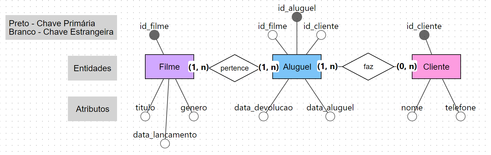

# Fixando o conteúdo

### 1 - Múltipla escolha
O campo que "empresta" a chave primária de outra tabela para criar uma ligação entre elas é chamado de:

( ) Chave candidata

( ) Chave primária

(/) Chave estrangeira

( ) Atributo derivado

### 2 - Identifique a cardinalidade
Para cada par de entidades, indique se a cardinalidade é 1:1, 1:N ou N:N:

(1:1) Pessoa e CPF

(1:N) Autor e Livro

(N:N) Ator e Filme

### 3 - Classifique o atributo
Classifique cada atributo abaixo como *(S)* simples, *(C)* composto, *(M)* multivalorado ou *(D)* derivado:

**(M)** Telefones de contato de um Cliente (pode ter mais de um)

**(C)** Endereço, dividido em rua/número/bairro

**(D)** Tempo de casa de um funcionário, calculado a partir da data de admissão

**(S)** CPF

### 4 - Estudo de caso — pratique o MER
Uma locadora de filmes quer um sistema com as entidades **Filme**, **Cliente** e **Aluguel**. 

Um cliente pode alugar vários filmes ao longo do tempo, e um filme pode ser alugado várias vezes (por clientes diferentes, em datas diferentes). 

Desenhe (no papel) as três entidades com pelo menos 3 atributos cada, aponte a chave primária de cada uma, e diga qual(is) tabela(s) vai(vão) precisar de chave estrangeira.

### 5 - Verdadeiro ou falso
**(F)** Uma entidade fraca pode existir no banco mesmo sem nenhuma ligação com uma entidade forte.

**(V)** Um relacionamento ternário envolve exatamente três entidades diferentes.

**(F)** Relacionamentos N:N podem ser implementados sem nenhuma tabela extra.
